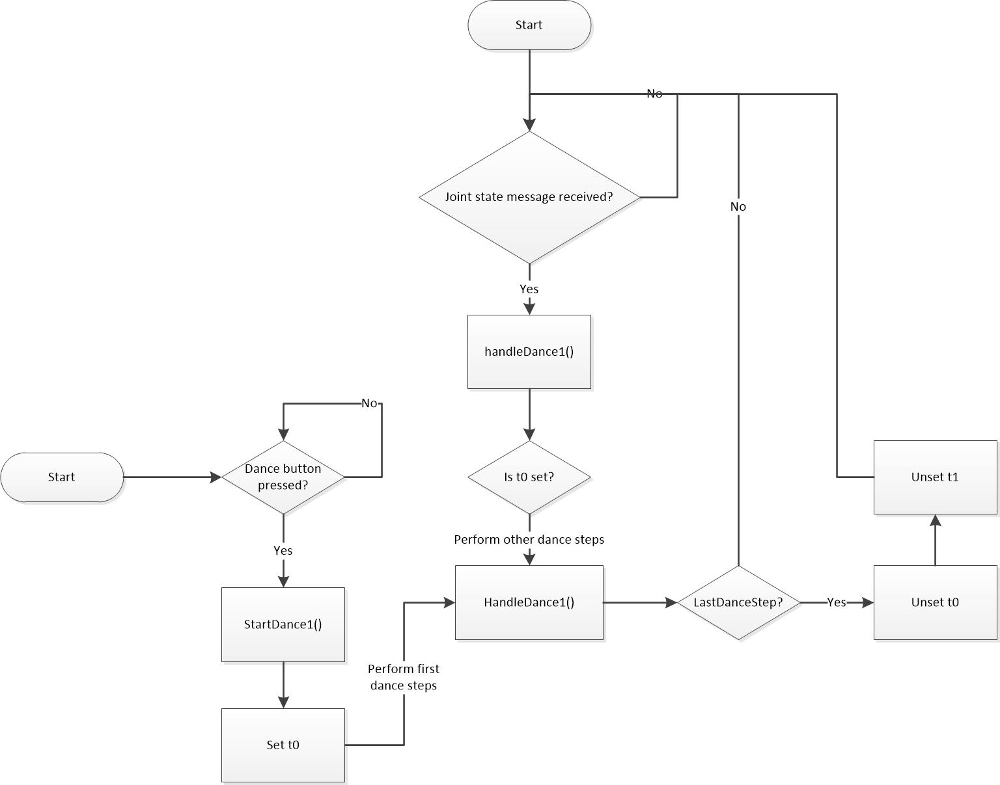

# Familiarize with Roboy system

Before implementing system specific modules, I have to familiarize with the Roboy system. A good use case to do this are the PaPiLegs, 
which can be seen as one possible prototype for Roboy 2.0's legs. 

## Familiarize with PaBiLegs

The setup for the PaBiLegs is quite straightforward. Nevertheless, I wrote a tutorial, which helps
other users to get started with the PaBiLegs in a fast and efficient way:
[Tutorial of how to control the PaBiLegs](https://devanthro.atlassian.net/wiki/display/CO/Tutorial+of+how+to+control+the+PaBiLegs)

After finishing this tutorial, you can see the user interface to control the motors. On the right side of the UI, there is a tab, which allows you to
control the motors and joints individually or all together.

## First example: Make Roboy dance

The problem is now that you can control the robot over the UI but we have no idea how the actions can be executed on
code level. Therefore, we want to write our own program, which sends first motors commands to the robot. One good use-case is to make the Roboy dance because
in July, there is a presentation at Google and Roboy should show there some dance moves. First of all, we will implement the following:

 - Add a button "Start dance" to the UI (**TODO: add UI tool that other people can use**)
 - Trigger a method, which makes the PaBiLegs move to the left, middle, right and back to the middle

### Add a button to the UI

First of all, open the [UI XML file](https://github.com/Roboy/myoFPGA/blob/5de1e1751091c34a3da620666ded3e0603e280d3/myoFPGA/src/interface/ui/main_window.ui) to your favorite UI program and add a button. After that we create a method `startDance1` to our MainWindow class and interface.
This method first of all initializes a variable `t0` with the current timestamp and a second variable `t1` with an dummy timestamp. Finally, the current step is set to `0`.

```c++
void MainWindow::startDance1() {
        t0 = ros::Time::now();
        t1 = ros::Time(0);
        currentDanceStep = 0;

        handleDance1();
}
```

This method is called at [the button click](https://github.com/Roboy/myoFPGA/blob/5de1e1751091c34a3da620666ded3e0603e280d3/myoFPGA/src/interface/src/main_window.cpp#L75) and this starts the dance process.
The reason for this is that the method `handleDance1` is divided in 5 steps:

1. Start dance move and make legs move to the left

    > Pre: `currentStep == 0`

    > Post: Joints are changed to move both of them to the left --> Legs moves to the left

    > Post: current step is increased

    > Post: T1 is set to a valid ROS time state to calculate the time difference from the starting time and the current time (https://github.com/Roboy/myoFPGA/blob/5de1e1751091c34a3da620666ded3e0603e280d3/myoFPGA/src/interface/src/main_window.cpp#L663)

2. Move to the middle

    > Pre: Difference from action start is `1200*1 ms` and check if `currentDanceStep == 1` ([https://github.com/Roboy/myoFPGA/blob/5de1e1751091c34a3da620666ded3e0603e280d3/myoFPGA/src/interface/src/main_window.cpp#L689](https://github.com/Roboy/myoFPGA/blob/5de1e1751091c34a3da620666ded3e0603e280d3/myoFPGA/src/interface/src/main_window.cpp#L689))

    > Post: Joints are changed to move both of them to the right --> Legs moves back to the center

    > Post: current step is increased

3. Move to the right

    > Pre: Difference from action start is `1200*2 ms` and check if `currentDanceStep == 2` ([https://github.com/Roboy/myoFPGA/blob/5de1e1751091c34a3da620666ded3e0603e280d3/myoFPGA/src/interface/src/main_window.cpp#L689](https://github.com/Roboy/myoFPGA/blob/5de1e1751091c34a3da620666ded3e0603e280d3/myoFPGA/src/interface/src/main_window.cpp#L682))

    > Post: Joints are changed to move both of them to the right --> Legs moves to the right

    > Post: current step is increased

4. Move to the middle

    > Pre: Difference from action start is `1200*3 ms` and check if `currentDanceStep == 3` ([https://github.com/Roboy/myoFPGA/blob/5de1e1751091c34a3da620666ded3e0603e280d3/myoFPGA/src/interface/src/main_window.cpp#L689](https://github.com/Roboy/myoFPGA/blob/5de1e1751091c34a3da620666ded3e0603e280d3/myoFPGA/src/interface/src/main_window.cpp#L675))

    > Post: Joints are changed to move both of them to the left --> Legs moves back to the center

    > Post: current step is increased

5. Finish

    > Pre: Difference from action start is `1200*4 ms` and check if `currentDanceStep == 4` ([https://github.com/Roboy/myoFPGA/blob/5de1e1751091c34a3da620666ded3e0603e280d3/myoFPGA/src/interface/src/main_window.cpp#L689](https://github.com/Roboy/myoFPGA/blob/5de1e1751091c34a3da620666ded3e0603e280d3/myoFPGA/src/interface/src/main_window.cpp#L668))

    > Post: current step is increased

    > Post: Timestamps `t0` and `t1` are resetted


So far this sounds hopefully reasonable but the most important point is to understand the process flow.


Therefore, the button starts the first dance step but the other dance steps are always started when a new joint message is received ([see here](https://github.com/Roboy/myoFPGA/blob/5de1e1751091c34a3da620666ded3e0603e280d3/myoFPGA/src/interface/src/main_window.cpp#L216))

## Next Steps

### Replace sleep with angle control

In the feature, it makes sense to replace the timeouts (usage of `t0` and `t1`) with the direct control whether the legs are in the correct position or not. That means that the next step is not performed until the next
joint state is reached. That means that we store the target state in the UI and check if the UI joint state and the current joint state - received over the messages - are nearly equal. After that the next step can be performed.

### Extract the joint calculation in a separate controller

At the moment, all the logic is in the UI. The problem is that this logic has to be extracted if you do not want to use the UI. Therefore, another next step is to
extract it in an own controller and create a main program, which calls this functionality in a plain main program without UI and only the ROS running.

Hint: Maybe use [https://github.com/Roboy/roboy_controller/blob/dfc8c1d89dac11478820105cd516b400abe9d59d/src/JointAngleController.cpp](https://github.com/Roboy/roboy_controller/blob/dfc8c1d89dac11478820105cd516b400abe9d59d/src/JointAngleController.cpp)
