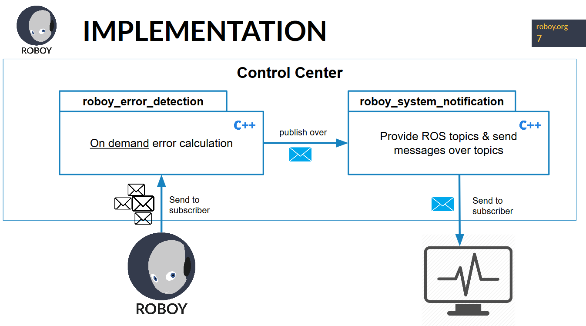

# Roboy Error Detection

## Problem statement

One new feature of the new Roboy version will be a increased maintainability. Therefore,
the following features (just an excerpt!) will be implemented this semester (SS2017):

 * Improved Calibration
 * Error detection

### Improved Calibration

Calibration is not the part of this documentation but the current state of the motors and angles is
required for the error detection process. The reason for this is explained in the following.

### Error detection

Apart from the improved calibration, another feature of Roboy 2.0 should be to detect errors, like shown in the following diagram: 
   

Therefore, the subtasks for this semester are:

After this semester, the 
following use-cases should be implemented: 
 - Task 1: an API is provided to send and publish notifications to other network participants (like sharing motor error messages)
    - [Define notification messages](notification-module-messages.md)
    - [Implement ROS notification module](notification-module.md)
 - Task 2: a new ROS module should be created, which listens to joints and motors to evaluate them and send/publish/share error messages
   to other network participants
    - [Familiarize with motors and joints](./familiarize-with-motors-and-joints.md)
    - [Define possible motor and joint states](./define-possible-motor-and-joint-states.md)
    - [Derive possible error patterns](./derive-possible-error-patterns.md)
    - [Implement error patterns](./implement-error-patterns.md)

More information can be found here: [https://devanthro.atlassian.net/wiki/display/CO/Research+-+Interface+to+Middleware](https://devanthro.atlassian.net/wiki/display/CO/Research+-+Interface+to+Middleware)
